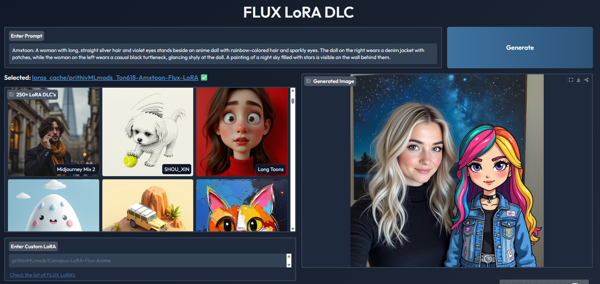

python - 3.11.9



## Installation

### Prerequisites

- **NVIDIA GPU with CUDA support**: this app is designed for CUDA
- **Python**: 3.11 recommended (this repo was tested with Python 3.11.9)
- **NVIDIA drivers**: install/update from [nvidia.com/drivers](https://www.nvidia.com/drivers)

### Setup Steps

1. **Create and activate virtual environment:**
   ```bash
   python -m venv venv
   venv\Scripts\activate  # Windows
   # or
   source venv/bin/activate  # Linux/Mac
   ```

2. **Install PyTorch with CUDA support:**
   
   **Option A - Using the provided script (Windows):**
   ```powershell
   .\install_cuda_pytorch.ps1
   ```
   or
   ```cmd
   install_cuda_pytorch.bat
   ```
   
   **Option B - Manual installation:**
   ```bash
   pip uninstall torch torchvision
   pip install torch torchvision --index-url https://download.pytorch.org/whl/cu121
   ```

3. **Install other requirements:**
   ```bash
   pip install -r requirements.txt
   ```

4. **Verify CUDA is working:**
   ```bash
   python -c "import torch; print(f'CUDA available: {torch.cuda.is_available()}')"
   ```
   Should output: `CUDA available: True`

### Troubleshooting

If CUDA is not available:

1. **Check NVIDIA GPU:**
   ```bash
   nvidia-smi
   ```
   If this fails, install/update NVIDIA drivers.

2. **Verify PyTorch CUDA build:**
   ```bash
   python -c "import torch; print(torch.version.cuda)"
   ```
   Should show a CUDA version (e.g., `12.1`), not `None`.

3. **Reinstall PyTorch with CUDA:**
   ```bash
   pip uninstall torch torchvision
   pip install torch torchvision --index-url https://download.pytorch.org/whl/cu121
   ```

4. **Install CUDA Toolkit** (if needed):
   - Download from [developer.nvidia.com/cuda-downloads](https://developer.nvidia.com/cuda-downloads)
   - Restart computer after installation

If you get CUDA out-of-memory (OOM):

- **Set PyTorch allocator to reduce fragmentation (Windows)**:

```powershell
setx PYTORCH_CUDA_ALLOC_CONF "expandable_segments:True"
```

- **Then restart your terminal** and try again.

### Running the Application

```bash
python app.py
```

The application will:
- Use local `models_cache` folder (not C drive `.cache`)
- Require CUDA to run
- Show detailed diagnostics on startup

---

## Offline installation (no internet)

Offline has **two parts**:

- **Python dependencies**: install from a local wheelhouse (`./wheels`)
- **Model files**: the base model + LoRAs must already exist in `models_cache/` and `loras_cache/`

### 1) On an ONLINE machine (same OS/Python as offline machine)

Create a venv, then build/download all wheels into `./wheels`:

```powershell
python -m venv venv
venv\Scripts\activate
pip install -U pip
powershell -ExecutionPolicy Bypass -File scripts\build_wheels.ps1
```

This will:
- Build wheels for git-based deps (`accelerate`, `diffusers`, `peft`)
- Download CUDA PyTorch wheels from the PyTorch CUDA index (cu121)
- Download all remaining PyPI wheels

### 1b) On the ONLINE machine: pre-download model files (required for offline runs)

This project loads the base model from Hugging Face into `models_cache/`, and LoRAs into `loras_cache/`.
Before going offline, run the app once online (recommended), or download explicitly:

- **Recommended** (simplest): run once online so caches fill, then copy `models_cache/` and `loras_cache/` to the offline machine.

Or, **explicit download** of the base model:

```powershell
venv\Scripts\python -c "from huggingface_hub import snapshot_download; snapshot_download(repo_id='black-forest-labs/FLUX.1-dev', local_dir='models_cache/black-forest-labs/FLUX.1-dev', local_dir_use_symlinks=False)"
```

If your `loras.json` points to Hugging Face repos, download them similarly (or run the app once online so it caches them).

### 2) Copy to the OFFLINE machine

Copy the entire project folder (including `./wheels`) to the offline machine.

### 3) On the OFFLINE machine

Create a venv and install only from `./wheels`:

```powershell
python -m venv venv
venv\Scripts\activate
powershell -ExecutionPolicy Bypass -File scripts\install_offline.ps1
```

Run in offline mode (prevents Hugging Face network calls):

```powershell
$env:FLUX_OFFLINE=1
python app.py
```

Notes:
- `FLUX_OFFLINE=1` makes the app **fail fast** if required model files are missing (it will not try the network).
- Make sure `models_cache/` contains the base model and `loras_cache/` contains the LoRAs you plan to use.
- The wheelhouse `./wheels` can be large and is ignored by git.

---

Check out the configuration reference at https://huggingface.co/docs/hub/spaces-config-reference